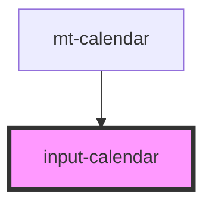

# input-calendar

<!-- Auto Generated Below -->

## Properties

| Property | Attribute | Description | Type     | Default |
| -------- | --------- | ----------- | -------- | ------- |
| `sDay`   | `s-day`   |             | `string` | `''`    |
| `sMonth` | `s-month` |             | `string` | `''`    |
| `sYear`  | `s-year`  |             | `string` | `''`    |

## Events

| Event        | Description | Type               |
| ------------ | ----------- | ------------------ |
| `dayFocus`   |             | `CustomEvent<any>` |
| `monthFocus` |             | `CustomEvent<any>` |
| `yearFocus`  |             | `CustomEvent<any>` |

## Dependencies

### Used by

 - [mt-calendar](../mt-calendar)

### Graph

----------------------------------------------

*Built with [StencilJS](https://stenciljs.com/)*
