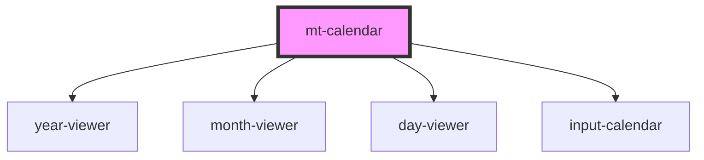

# mt-calendar

<!-- Auto Generated Below -->

## Properties

| Property      | Attribute     | Description | Type     | Default     |
| ------------- | ------------- | ----------- | -------- | ----------- |
| `endyear`     | `endyear`     |             | `number` | `undefined` |
| `initialyear` | `initialyear` |             | `number` | `undefined` |

## Dependencies

### Depends on

- [year-viewer](../viewers/year-viewer)
- [month-viewer](../viewers/month-viewer)
- [day-viewer](../viewers/day-viewer)
- [input-calendar](../input-calendar)

### Graph

----------------------------------------------

*Built with [StencilJS](https://stenciljs.com/)*
