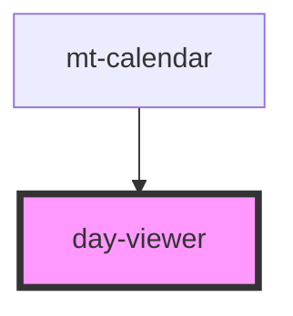

# day-viewer

<!-- Auto Generated Below -->

## Properties

| Property        | Attribute       | Description | Type             | Default     |
| --------------- | --------------- | ----------- | ---------------- | ----------- |
| `selectedDate`  | `selected-date` |             | `string`         | `undefined` |
| `selectedDates` | --              |             | `CalendarDate[]` | `[]`        |
| `selectedDay`   | `selected-day`  |             | `string`         | `''`        |

## Events

| Event         | Description | Type               |
| ------------- | ----------- | ------------------ |
| `onSelectDay` |             | `CustomEvent<any>` |

## Dependencies

### Used by

 - [mt-calendar](../../mt-calendar)

### Graph

----------------------------------------------

*Built with [StencilJS](https://stenciljs.com/)*
