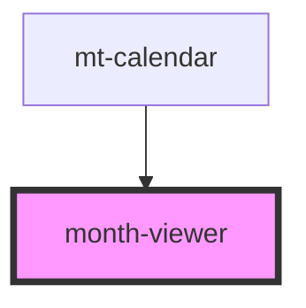

# month-viewer

<!-- Auto Generated Below -->

## Properties

| Property        | Attribute        | Description | Type     | Default |
| --------------- | ---------------- | ----------- | -------- | ------- |
| `selectedMonth` | `selected-month` |             | `string` | `''`    |

## Events

| Event           | Description | Type               |
| --------------- | ----------- | ------------------ |
| `onSelectMonth` |             | `CustomEvent<any>` |

## Dependencies

### Used by

 - [mt-calendar](../../mt-calendar)

### Graph

----------------------------------------------

*Built with [StencilJS](https://stenciljs.com/)*
