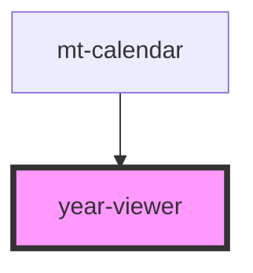

# year-viewer

<!-- Auto Generated Below -->

## Properties

| Property       | Attribute       | Description | Type     | Default |
| -------------- | --------------- | ----------- | -------- | ------- |
| `endYear`      | `end-year`      |             | `number` | `0`     |
| `initialYear`  | `initial-year`  |             | `number` | `1960`  |
| `selectedYear` | `selected-year` |             | `string` | `''`    |

## Events

| Event           | Description | Type               |
| --------------- | ----------- | ------------------ |
| `calendarFocus` |             | `CustomEvent<any>` |
| `onSelectYear`  |             | `CustomEvent<any>` |

## Dependencies

### Used by

 - [mt-calendar](../../mt-calendar)

### Graph

----------------------------------------------

*Built with [StencilJS](https://stenciljs.com/)*
